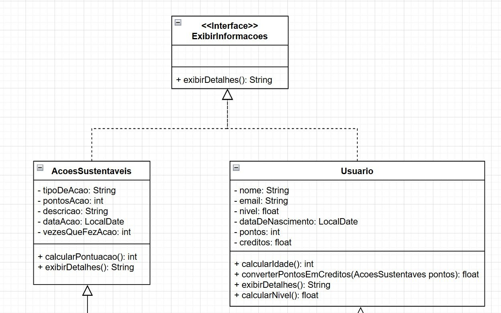
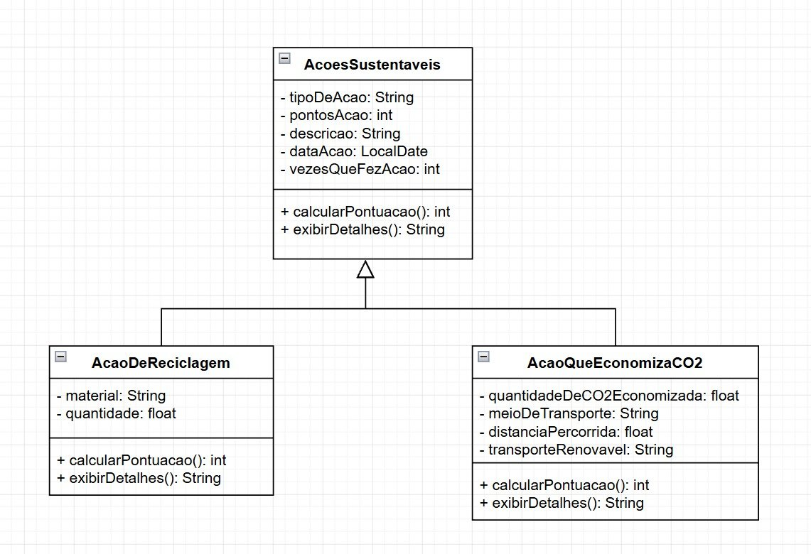
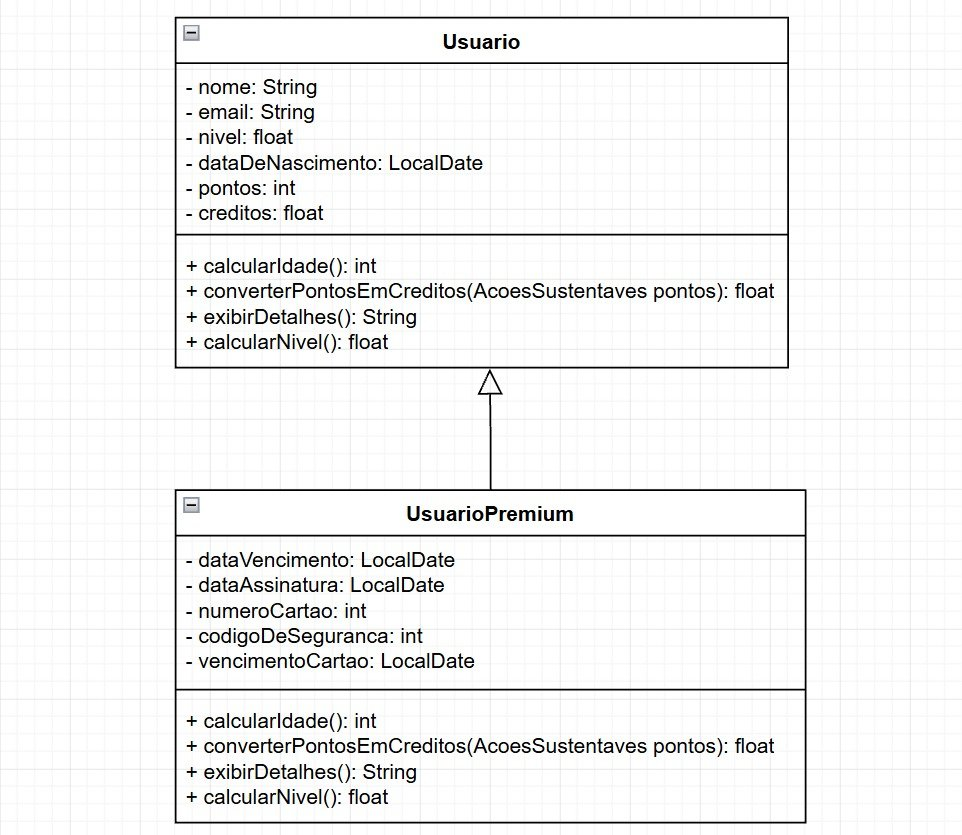

# 🌱 SoulUp

> Plataforma de gamificação sustentável que transforma ações ecológicas em recompensas reais.


## 📖 Sobre o Projeto

A **SoulUp** é uma plataforma digital criada com o objetivo de incentivar hábitos sustentáveis por meio de técnicas de gamificação. O sistema permite que usuários registrem ações ecológicas do cotidiano — como reciclagem, economia de energia e uso de transporte público — acumulando pontos e evoluindo em rankings e níveis.

O projeto surgiu como solução para um desafio acadêmico focado em sustentabilidade, tecnologia e engajamento social, unindo desenvolvimento de software, experiência do usuário e impacto ambiental.

---

## 🎯 Objetivo

A proposta da SoulUp é reduzir a distância entre a conscientização ambiental e a prática diária de hábitos sustentáveis, utilizando:

* ✅ Gamificação
* ✅ Sistema de recompensas
* ✅ Rankings e progressão
* ✅ Métricas de impacto ambiental
* ✅ Engajamento comunitário

---

## 🚀 Funcionalidades

### 👤 Usuários

* Cadastro e autenticação
* Perfil personalizado
* Sistema de níveis sustentáveis

### 🌍 Ações Sustentáveis

* Registro de ações ecológicas
* Pontuação baseada em impacto ambiental
* Categorias de sustentabilidade
* Relatórios de impacto

### 🏆 Gamificação

* Sistema de XP e níveis
* Conquistas e progressão
* Recompensas por desempenho

### 📊 Métricas Ambientais

* CO₂ evitado

---

## 🧠 Tecnologias Utilizadas

### Backend

* Java
* Programação Orientada a Objetos (POO)

### Ferramentas

* IntelliJ IDEA
* Git & GitHub

---

## 🧩 Diagramas UML

### 📌 Estrutura Geral do Sistema

Diagrama com a interface `ExibirInformacoes` e as classes principais `AcoesSustentaveis` e `Usuario`:



### 📌 Herança das Ações Sustentáveis

Diagrama de herança com `AcoesSustentaveis` como base e as subclasses `AcaoDeReciclagem` e `AcaoQueEconomizaCO2`:



### 📌 Herança do Usuário

Diagrama de herança com `Usuario` como base e a subclasse `UsuarioPremium`:



Os diagramas acima representam a arquitetura orientada a objetos do projeto, evidenciando:

* Uso de interfaces
* Herança entre classes
* Polimorfismo
* Encapsulamento
* Especialização de ações sustentáveis

---

## 🏗️ Estrutura do Projeto

```bash
SoulUp/
├── src/
│   ├── model/
│   ├── service/
│   ├── controller/
│   ├── repository/
│   └── view/
├── docs/
└── README.md
```

---


## 📷 Conceito da Plataforma

A SoulUp utiliza mecânicas inspiradas em aplicativos modernos de produtividade e saúde, transformando ações ambientais em uma experiência interativa, educativa e competitiva.

O usuário recebe pontos por atitudes sustentáveis e acompanha sua evolução em tempo real através de rankings, conquistas e indicadores de impacto ambiental.

---

## 💡 Diferenciais do Projeto

* Sistema de recompensas reais
* Foco em retenção e engajamento
* Transparência no impacto ambiental
* Competitividade saudável entre usuários
* Integração entre sustentabilidade e tecnologia

---

## 👨‍💻 Equipe

Projeto desenvolvido por:

* Pedro Henrique Salvatore
* Cauã De Souza Vasconcellos
* Leonardo De Souza Bernard
* Luigi Tormim Carqueijeiro

FIAP — Análise e Desenvolvimento de Sistemas

---

## 📚 Aprendizados

Durante o desenvolvimento do projeto foram aplicados conceitos de:

* Programação Orientada a Objetos
* Arquitetura de Software
* Modelagem de Banco de Dados
* Sustentabilidade aplicada à tecnologia
* Engenharia de Software
* Gamificação

---

## 🔮 Melhorias Futuras

* Integração com APIs de geolocalização
* Reconhecimento de imagens com IA
* Aplicativo mobile
* Sistema de desafios semanais
* Marketplace de recompensas
* Dashboard analítico avançado

---

## 📄 Licença

Este projeto foi desenvolvido para fins acadêmicos e educacionais.

---

## ⭐ Contribuição

Sinta-se à vontade para abrir issues, sugerir melhorias ou contribuir com novas funcionalidades.

---

## 📬 Contato

Caso queira trocar ideias sobre o projeto:

* GitHub: *Pedro-H-Salvatore*
* LinkedIn: *https://www.linkedin.com/in/pedro-salvatore-a4a2763b7/*

---

> "Pequenas ações sustentáveis geram grandes impactos quando feitas coletivamente." 🌎
